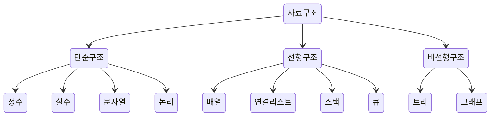

# 자료구조의 종류

### 1. 자료구조의 종류

#### 선형 구조

한 원소 뒤에 하나의 원소만이 존재하는 형태로  
자료들이 선형으로 나열되어 있는 구조를 가진다.

> ex) 배열, 연결리스트, 스택, 큐

#### 비선형 구조

원소간 다대다 관계를 가지는 구조로  
계층적 구조나 망형 구조를 표현하기에 적절하다.

> ex) 트리, 그래프

   
 

:arrow_forward: [03 시간 복잡도](./03%20%EC%8B%9C%EA%B0%84%20%EB%B3%B5%EC%9E%A1%EB%8F%84.md) :arrow_forward:
